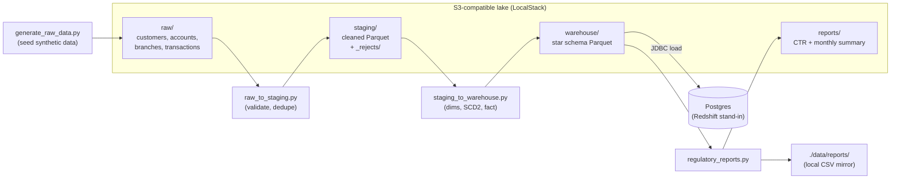
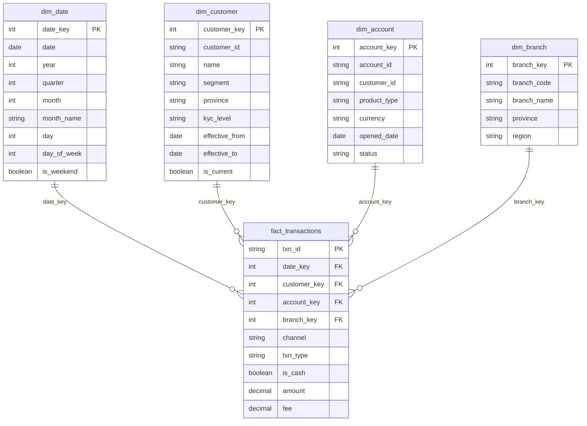

# PySpark Banking Warehouse

[](https://github.com/mortogo321/pyspark-banking-warehouse/actions/workflows/ci.yml)
[](https://www.python.org/downloads/)
[](https://spark.apache.org/)
[](LICENSE)

A Docker-first data-engineering showcase: a synthetic banking data lake on
S3-compatible object storage, a Glue-style PySpark ETL pipeline, a star-schema
warehouse loaded into Postgres (standing in for Redshift), and two
regulator-style reports produced at the end of the pipeline.

Everything runs in containers. There is no dependency on a local Java or
Python install — `docker compose build` and a handful of `make` targets are
the whole interface.

## What this demonstrates

- A layered data lake (raw / staging / warehouse / reports) on S3-compatible
  storage, built and read with PySpark exactly as it would be from an AWS
  Glue job.
- Data-quality gating: malformed and duplicate rows are rejected at the
  raw-to-staging boundary, with counts logged rather than silently dropped.
- A conformed star schema with a Type 2 slowly-changing dimension
  (`dim_customer`), including the point-in-time fact join that makes SCD2
  worth doing in the first place.
- Loading a dimensional model into a warehouse over JDBC, with the Redshift
  equivalent (COPY from S3 Parquet, DISTKEY/SORTKEY choices) documented
  alongside it.
- Two regulator-style batch reports built from the warehouse: an AML
  threshold report (CTR-style) and a central-bank-style monthly summary.

## Architecture



All four jobs are plain `spark-submit` scripts run inside the `spark`
container. On real AWS, the same scripts are what would run inside a Glue
job — see [Mapping to real AWS](#mapping-to-real-aws).

## Skills demonstrated

| Area | Specifics |
|---|---|
| PySpark | DataFrame transforms, window functions, explicit schemas, joins, aggregations |
| SQL | star-join analytics queries, DDL for two dialects (Postgres, Redshift) |
| AWS patterns | S3 data lake layout, Glue-job-shaped scripts, Redshift COPY/DISTKEY/SORTKEY |
| Dimensional modeling | star vs. snowflake trade-offs, surrogate keys, degenerate dimension |
| SCD Type 2 | change detection, effective-dated history, point-in-time fact joins |
| Data quality | schema-on-read validation, dedupe, reject-with-reason logging |
| Regulatory reporting | AML threshold (CTR-style) report, monthly regulator-style summary |
| Testing | pure-function transforms unit-tested with local Spark, no cloud dependencies |

## Data model

Star schema, grain of `fact_transactions`: **one row per bank transaction.**



Notes on the modeling choices:

- **`channel` is a degenerate dimension.** It only ever takes a handful of
  values (`branch`, `atm`, `mobile`, `internet`) with no attributes of its
  own, so it lives directly on the fact row instead of behind a join to a
  one-column dimension table.
- **`dim_customer` is Type 2.** Each customer snapshot ingested by
  `staging_to_warehouse.py` is merged into history: an unchanged customer's
  row is left alone, a changed attribute closes the old row
  (`effective_to` = the new snapshot's date, `is_current = false`) and opens
  a new one, and a brand-new customer just gets a new row. `fact_transactions`
  resolves `customer_key` by matching each transaction's date against the
  dimension row whose `[effective_from, effective_to]` range contains it, so
  a transaction is attributed to the customer attributes that were actually
  in effect on that day — not whatever the customer looks like today.
- **`dim_branch` is a star, not a snowflake.** `region` could be normalized
  out into its own `dim_region` table (branch → region), which would remove
  a small amount of repeated text and let a region's attributes change in
  one place. It isn't, here: there are only 8 branches, `region` never
  changes independently of the branch, and the extra join would cost more
  in query complexity than the normalization would save in storage. A
  snowflake would earn its keep with hundreds of branches and richer,
  independently-changing region attributes.

## Run it

```bash
cp .env.example .env   # optional — every value has a working default

docker compose build
make up        # start localstack + postgres, wait for health checks
make seed      # generate synthetic data into s3a://lake/raw/
make etl       # raw -> staging (validate/dedupe) -> warehouse (star schema + Postgres load)
make report    # build the two regulatory reports
make test      # run the unit tests (local Spark, no S3/Postgres)
```

Inspect the results:

```bash
make psql
# \dt
# select count(*) from fact_transactions;
# select is_current, count(*) from dim_customer group by is_current;

ls data/reports/
# ctr_report_2026-04.csv  ctr_report_2026-05.csv  ctr_report_2026-06.csv  monthly_summary.csv
```

Tear down:

```bash
make down   # docker compose down -v
```

### Data generated

Deterministic (fixed random seed) and reproducible: ~2,000 customers, ~3,000
accounts across 8 branches (Thai provinces), ~60,000 transactions over a
90-day window ending 2026-06-30. A second customer snapshot changes
province/segment for ~5% of customers to exercise the SCD2 path, and a small
number of deliberately dirty transaction rows (nulls, duplicate IDs, negative
amounts) are injected so `raw_to_staging.py` has real rows to reject.

## Mapping to real AWS

Nothing in `src/pipeline/` or `jobs/` is LocalStack- or Postgres-specific; only
the configuration in `src/pipeline/config.py` points at local infrastructure.

| This repo | Real AWS equivalent |
|---|---|
| LocalStack S3 (`s3a://lake/...`) | S3, same bucket/key layout |
| `docker compose run spark spark-submit jobs/<job>.py` | An AWS Glue job (Spark) running the *same* script unchanged |
| Postgres + JDBC load | Redshift, loaded via `COPY ... FROM 's3://...' FORMAT AS PARQUET` from the same warehouse Parquet output — see `sql/redshift/02_copy_from_s3.sql` |
| `sql/postgres/init.sql` | `sql/redshift/01_create_tables.sql` (DISTSTYLE/DISTKEY/SORTKEY chosen for the fact/dim sizes — see comments in that file) |
| Explicit StructTypes in `src/pipeline/schemas.py` | Would also back a Glue Data Catalog table definition, so Athena/Redshift Spectrum can query the same S3 Parquet without re-deriving schema |
| Everything read/written unpartitioned | Real S3 paths would partition `raw/transactions` and `warehouse/fact_transactions` by date (e.g. `dt=2026-06-30/`) so both the Glue job and downstream query engines can prune input instead of scanning the whole table |
| Static `test`/`test` credentials | IAM role attached to the Glue job / Redshift cluster; no static keys at all |

## Repository layout

```
jobs/                   spark-submit entry points (seed, ETL, reports)
src/pipeline/           config, SparkSession factory, schemas, pure transforms
sql/postgres/init.sql   DDL actually run by the postgres container
sql/redshift/           reference-only Redshift DDL, COPY commands, example queries
tests/                  pytest + local Spark, no S3/Postgres required
docker/Dockerfile       Spark image + hadoop-aws/aws-sdk/postgres JDBC jars
```
